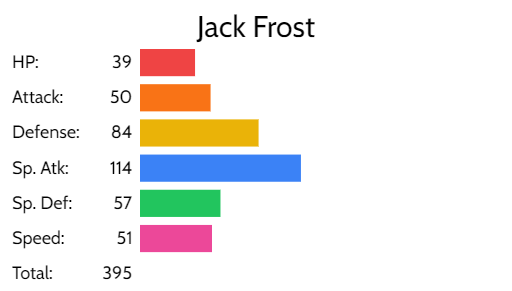
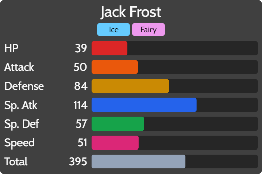

# BST Graph

Generate Pokémon base stat total graphs similar to what's seen on Bulbapedia.

# Features

-   Can fully edit any stat and use any name.
    -   Great for fakémon!
-   Export to PNG or SVG.
-   Autofill stats from Pokémon name. (Based on Generation 8.)
-   Also works on mobile!
-   Open source under MIT license.

# More information

-   For more info about using autofill, see [autofill.md](docs/autofill.md).
-   For build instructions, see [dev_info.md](docs/dev_info.md).

# Special thanks

BST Graph uses [PokeAPI](https://pokeapi.co/) to autofill data, [pokenode-ts](https://pokenode-ts-docs-gabb-c.vercel.app/) for caching that data, [dom-to-svg](https://github.com/felixfbecker/dom-to-svg) for generating svg images, and [Vue](https://vuejs.org/) for the frontend. Without them, the making of BST Graph would have been significantly harder!

# DISCLAIMER

BST Graph is NOT an official product and is not associated with Pokémon, The Pokémon Company, Nintendo, Creatures Inc., or any of their respective copyright holders.
